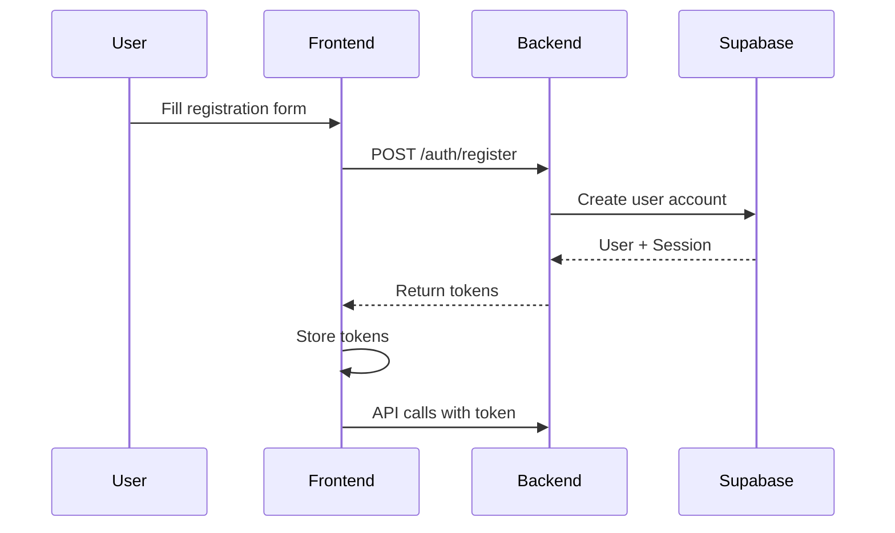
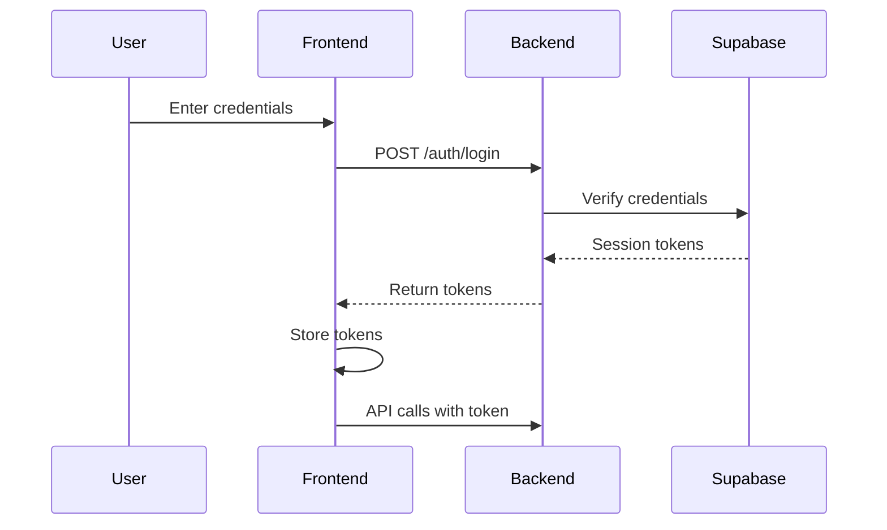
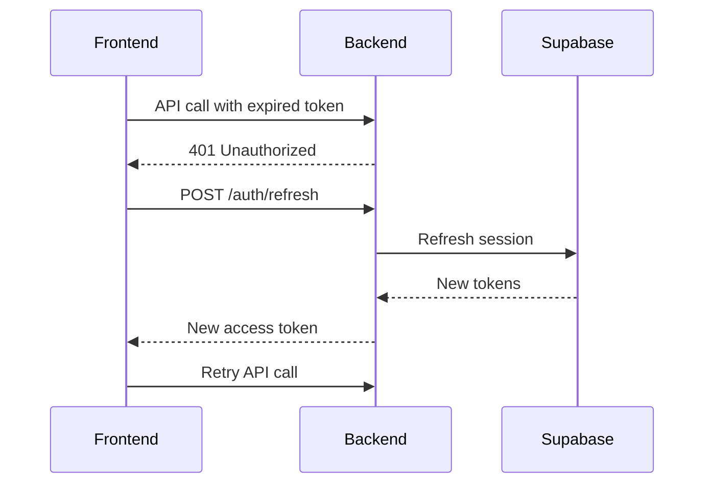

# Phase 3: Backend Authentication Implementation

## Overview

Phase 3 implements JWT-based authentication using Supabase Auth, providing secure user registration, login, and session management. All API endpoints now require authentication, ensuring user data isolation.

## Implementation Summary

### ✅ Completed Components

1. **Authentication Middleware** (`backend/middleware/auth.py`)
2. **Authentication Service** (`backend/services/auth_service.py`)
3. **Auth Routes** (`backend/routes/auth.py`)
4. **Updated Entry Routes** (`backend/routes/entries.py`)
5. **Updated Chat Routes** (`backend/routes/chat.py`)
6. **Updated Entry Service** (`backend/services/entry_service.py`)
7. **Updated NLP Service** (`backend/services/nlp_service_v2.py`)
8. **Auth Schemas** (`backend/models/schemas.py`)

---

## 1. Authentication Middleware

**File:** `backend/middleware/auth.py`

### Purpose

Validates JWT tokens from Supabase Auth and extracts user context for protected endpoints.

### Key Functions

#### `verify_token(token: str) -> dict`

- Validates JWT signature and expiry using Supabase client
- Returns user information (user_id, email, role, metadata)
- Raises HTTP 401 if token is invalid or expired

#### `get_current_user(credentials) -> dict`

- FastAPI dependency for extracting authenticated user
- Requires `Authorization: Bearer <token>` header
- Used in routes that need full user info

#### `get_current_user_id(credentials) -> UUID`

- FastAPI dependency for extracting user UUID
- Convenience wrapper for routes that only need user_id
- Most commonly used dependency

### Usage Example

```python
from middleware.auth import get_current_user_id
from uuid import UUID

@router.post("/entries/")
async def create_entry(
    entry: EntryCreate,
    user_id: UUID = Depends(get_current_user_id)
):
    # user_id is automatically extracted from JWT
    return await EntryService.create_entry(..., user_id=user_id)
```

---

## 2. Authentication Service

**File:** `backend/services/auth_service.py`

### Purpose

Handles all authentication operations with Supabase Auth API.

### Key Methods

#### `register_user(email, password, name) -> dict`

- Creates new user account in Supabase Auth
- Stores optional display name in user metadata
- Returns user info and session tokens
- Handles duplicate email errors

#### `login_user(email, password) -> dict`

- Authenticates user credentials
- Returns session with access_token and refresh_token
- Access tokens expire in 1 hour (configurable in Supabase dashboard)

#### `logout_user(access_token) -> bool`

- Invalidates current session
- Signs user out from Supabase Auth

#### `refresh_session(refresh_token) -> dict`

- Refreshes expired access token
- Returns new session tokens
- Refresh tokens valid for 7 days (configurable)

#### `verify_user_email(access_token) -> dict`

- Validates access token
- Returns user information
- Used for token verification

### Response Format

```python
{
    "user": {
        "id": "uuid-here",
        "email": "user@example.com",
        "name": "John Doe",
        "created_at": "2025-10-08T12:00:00Z"
    },
    "session": {
        "access_token": "jwt-token-here",
        "refresh_token": "refresh-token-here",
        "expires_at": 1696780800
    }
}
```

---

## 3. Auth Routes

**File:** `backend/routes/auth.py`

### Endpoints

#### `POST /api/v1/auth/register`

**Register a new user**

Request:

```json
{
  "email": "user@example.com",
  "password": "securepassword123",
  "name": "John Doe" // optional
}
```

Response (201):

```json
{
  "user": {
    "id": "user-uuid",
    "email": "user@example.com",
    "name": "John Doe",
    "created_at": "2025-10-08T12:00:00Z"
  },
  "session": {
    "access_token": "eyJhbGciOiJI...",
    "refresh_token": "refresh-token",
    "expires_at": 1696780800
  },
  "message": "User registered and logged in successfully."
}
```

Errors:

- `409 Conflict`: Email already exists
- `400 Bad Request`: Password too short (min 8 chars)

---

#### `POST /api/v1/auth/login`

**Log in existing user**

Request:

```json
{
  "email": "user@example.com",
  "password": "securepassword123"
}
```

Response (200):

```json
{
  "user": {
    /* same as register */
  },
  "session": {
    /* same as register */
  },
  "message": "Login successful"
}
```

Errors:

- `401 Unauthorized`: Invalid email or password

---

#### `POST /api/v1/auth/logout`

**Log out current user**

Headers:

```
Authorization: Bearer <access_token>
```

Response (200):

```json
{
  "message": "Logout successful"
}
```

---

#### `POST /api/v1/auth/refresh`

**Refresh expired access token**

Request:

```json
{
  "refresh_token": "refresh-token-here"
}
```

Response (200):

```json
{
  "access_token": "new-jwt-token",
  "refresh_token": "new-refresh-token",
  "expires_at": 1696784400
}
```

Errors:

- `401 Unauthorized`: Invalid or expired refresh token

---

#### `GET /api/v1/auth/verify`

**Verify current access token**

Headers:

```
Authorization: Bearer <access_token>
```

Response (200):

```json
{
  "user": {
    "id": "user-uuid",
    "email": "user@example.com",
    "name": "John Doe",
    "created_at": "2025-10-08T12:00:00Z"
  },
  "email_confirmed": true
}
```

---

#### `GET /api/v1/auth/me`

**Get current user info**

Headers:

```
Authorization: Bearer <access_token>
```

Response (200):

```json
{
  "id": "user-uuid",
  "email": "user@example.com",
  "name": "John Doe",
  "created_at": "2025-10-08T12:00:00Z"
}
```

---

## 4. Protected Routes

All `/api/v1/entries/*` and `/api/v1/chat/*` endpoints now require authentication.

### Updated Entry Routes

**All entry operations now scoped to authenticated user:**

#### `POST /api/v1/entries/`

- Creates entry for authenticated user
- Automatically sets `user_id` from JWT

#### `GET /api/v1/entries/`

- Returns only entries belonging to authenticated user
- Filtering/pagination scoped to user's data

#### `PATCH /api/v1/entries/{entry_id}`

- Updates entry only if it belongs to authenticated user
- Returns 404 if entry doesn't exist or belongs to another user

#### `DELETE /api/v1/entries/{entry_id}`

- Deletes entry only if it belongs to authenticated user
- Returns 404 if entry doesn't exist or belongs to another user

### Request Headers

All protected endpoints require:

```
Authorization: Bearer <access_token>
```

### Error Responses

**401 Unauthorized** - Missing or invalid token:

```json
{
  "detail": "Could not validate credentials"
}
```

**404 Not Found** - Entry doesn't exist or doesn't belong to user:

```json
{
  "detail": "Entry not found"
}
```

---

## 5. User Isolation Implementation

### Database Level

All database operations filter by `user_id`:

```python
# Entry Service - Get Entries
query = db.client.table("entry").select("*")
query = query.eq("user_id", str(user_id))  # Critical filter
```

```python
# Entry Service - Update Entry
query = db.client.table("entry").update(data)
query = query.eq("id", entry_id)
query = query.eq("user_id", user_id)  # Prevents cross-user updates
```

### NLP Service

The NLP service now requires `user_id` for all operations:

```python
# Creating entries via NLP
entry_data = {
    "amount_cents": amount,
    "direction": direction,
    "user_id": str(user_id),  # Required field
    ...
}
```

```python
# Reading entries via NLP
query = db.client.table("entry").select("*")
query = query.eq("user_id", str(user_id))  # User-scoped queries
```

---

## 6. Authentication Flow

### Registration Flow



### Login Flow



### Token Refresh Flow



---

## 7. Security Features

### JWT Validation

- **Signature Verification**: Supabase validates JWT signature
- **Expiry Check**: Tokens expire after 1 hour
- **User Verification**: Token linked to valid user account

### Password Requirements

- Minimum 8 characters
- Enforced by Supabase Auth
- Can be configured in Supabase dashboard

### Data Isolation

- **User-scoped queries**: All database queries filter by user_id
- **Ownership validation**: Updates/deletes verify user owns resource
- **No cross-user access**: Users can't access other users' data

### Token Storage

**Frontend should:**

- Store access_token in memory or sessionStorage
- Store refresh_token in httpOnly cookie (recommended)
- Never store tokens in localStorage (XSS vulnerability)

---

## 8. Testing Authentication

### Manual Testing with cURL

**Register:**

```bash
curl -X POST http://localhost:8000/api/v1/auth/register \
  -H "Content-Type: application/json" \
  -d '{"email":"test@example.com","password":"password123","name":"Test User"}'
```

**Login:**

```bash
curl -X POST http://localhost:8000/api/v1/auth/login \
  -H "Content-Type: application/json" \
  -d '{"email":"test@example.com","password":"password123"}'
```

**Create Entry (authenticated):**

```bash
curl -X POST http://localhost:8000/api/v1/entries/ \
  -H "Content-Type: application/json" \
  -H "Authorization: Bearer YOUR_ACCESS_TOKEN" \
  -d '{"amount":50.00,"direction":"expense","entry_date":"2025-10-08","description":"Lunch"}'
```

**Get Entries (authenticated):**

```bash
curl -X GET http://localhost:8000/api/v1/entries/ \
  -H "Authorization: Bearer YOUR_ACCESS_TOKEN"
```

---

## 9. Configuration

### Supabase Settings

**Required in `.env`:**

```bash
# Development
SUPABASE_URL_DEV=your-dev-supabase-url
SUPABASE_KEY_DEV=your-dev-anon-key
SUPABASE_SERVICE_ROLE_KEY_DEV=your-dev-service-key

# Production
SUPABASE_URL_PROD=your-prod-supabase-url
SUPABASE_KEY_PROD=your-prod-anon-key
SUPABASE_SERVICE_ROLE_KEY_PROD=your-prod-service-key

# Environment
ENVIRONMENT=development  # or production
```

### Auth Settings in Supabase Dashboard

1. **Email Provider**: Enabled
2. **JWT Expiry**: 3600 seconds (1 hour)
3. **Refresh Token Lifetime**: 604800 seconds (7 days)
4. **Email Confirmations**: Disabled (for MVP)
5. **Site URL**: `http://localhost:5173` (dev)
6. **Redirect URLs**: `http://localhost:5173/**`

---

## 10. Migration Notes

### Existing Data

- All 930 existing entries are assigned to system user
- System user ID: `00000000-0000-0000-0000-000000000001`
- New users start with empty data sets
- System user entries remain isolated

### Breaking Changes

**All entry endpoints now require authentication:**

- Previous API calls without tokens will return 401
- Frontend must be updated to send Authorization headers
- Test scripts must include authentication

---

## 11. Next Steps

### Frontend Integration (Phase 4)

1. **Auth Context Provider**

   - Manage authentication state
   - Store tokens securely
   - Handle token refresh

2. **Login/Register Components**

   - Login form
   - Registration form
   - Password reset (future)

3. **Protected Routes**

   - Redirect unauthenticated users to login
   - Show loading state during auth check
   - Handle session expiry

4. **API Client Updates**
   - Add Authorization header to all requests
   - Implement token refresh interceptor
   - Handle 401 errors gracefully

### Future Enhancements

1. **Email Verification**

   - Enable email confirmations
   - Send verification emails
   - Handle verification flow

2. **Password Reset**

   - Forgot password flow
   - Reset token generation
   - Password update endpoint

3. **Multi-Factor Authentication**

   - TOTP support
   - SMS verification
   - Backup codes

4. **Social Login**
   - Google OAuth
   - GitHub OAuth
   - Other providers

---

## 12. Troubleshooting

### Common Issues

**401 Unauthorized:**

- Check token is being sent in Authorization header
- Verify token hasn't expired
- Ensure token format is `Bearer <token>`

**409 Conflict on Registration:**

- User with email already exists
- Try different email or log in instead

**403 Forbidden:**

- User doesn't have permission for operation
- Check RLS policies in Supabase

**Entry Not Found (404):**

- Entry doesn't exist
- Entry belongs to different user
- Check user_id in database

### Debugging

**Enable debug logging:**

```python
# In backend/config/settings.py
debug: bool = True
```

**Check Supabase logs:**

- Go to Supabase Dashboard → Logs
- Filter by service: `auth` or `api`
- Look for authentication errors

**Verify user_id:**

```sql
-- Check which user owns an entry
SELECT user_id, description FROM entry WHERE id = 'entry-uuid';

-- See all users
SELECT id, email, created_at FROM auth.users;
```

---

## Summary

✅ **Phase 3 Complete**: Backend authentication fully implemented with Supabase Auth

**Key Achievements:**

- JWT-based authentication
- User registration and login
- Protected API endpoints
- User data isolation
- Token refresh mechanism
- Comprehensive error handling

**Ready for Phase 4:** Frontend authentication integration
